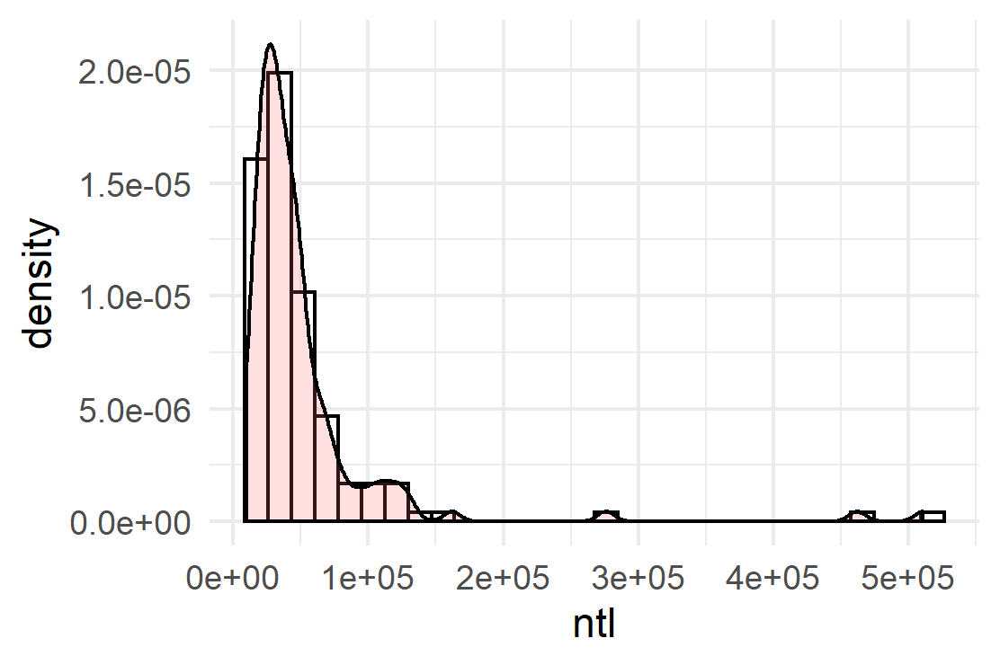
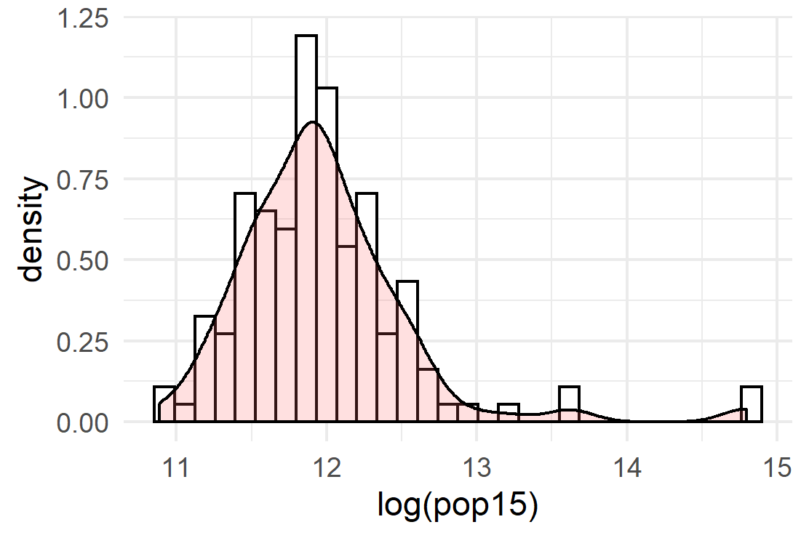
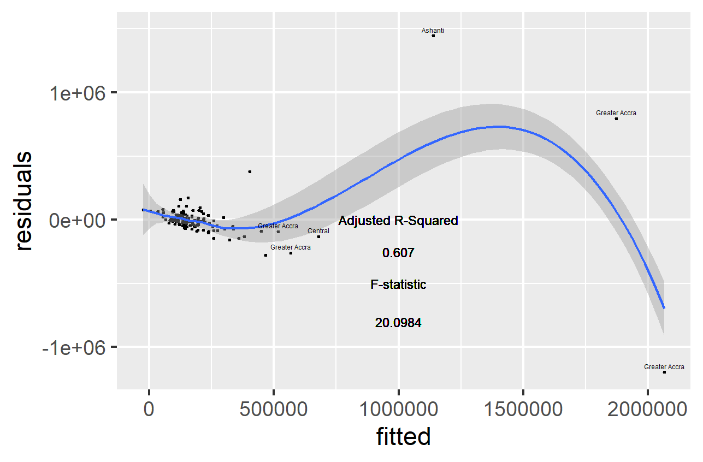
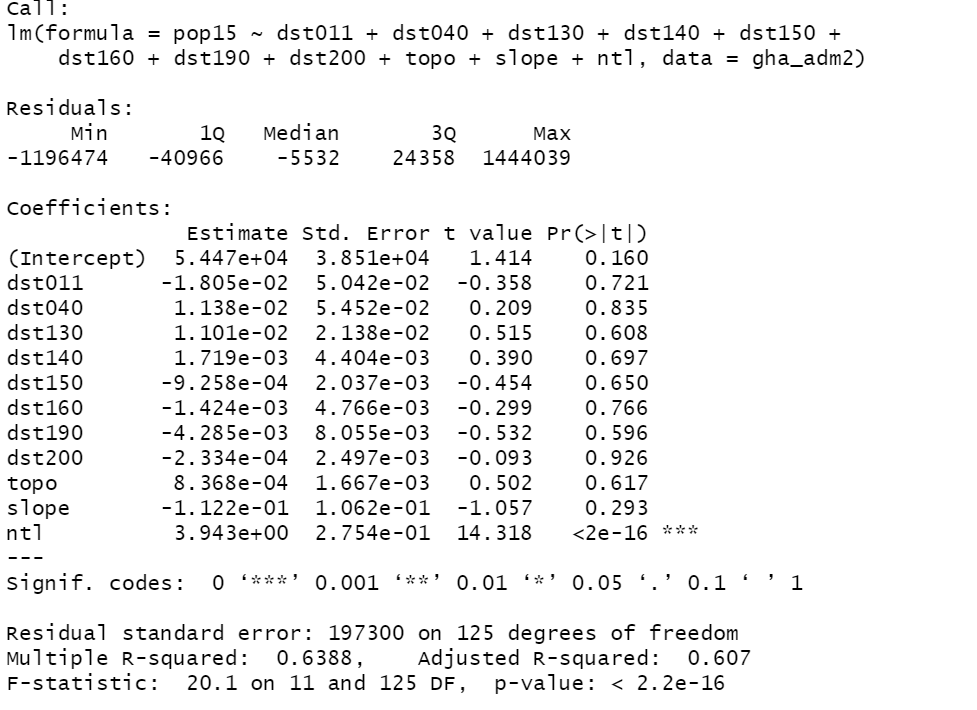
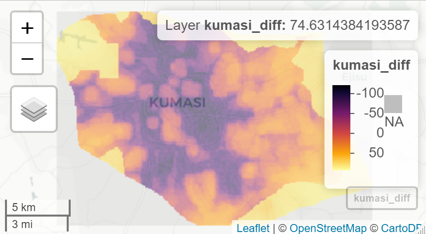
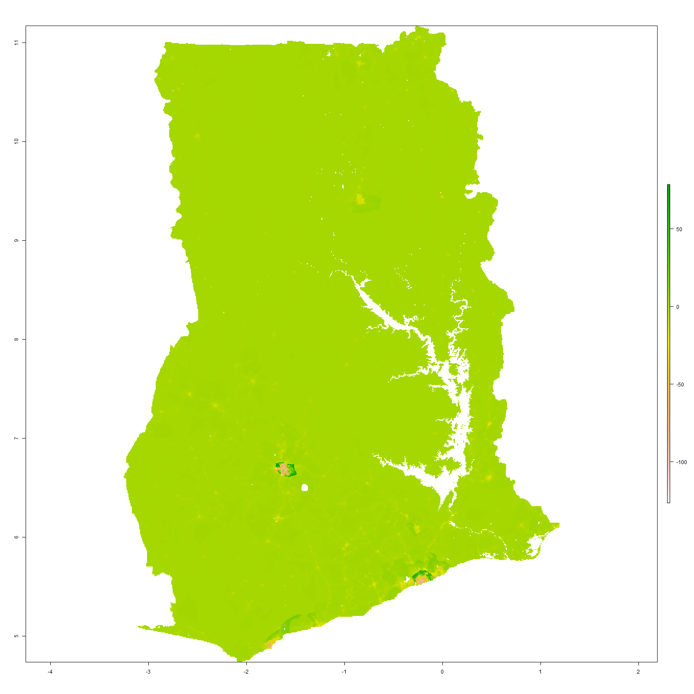
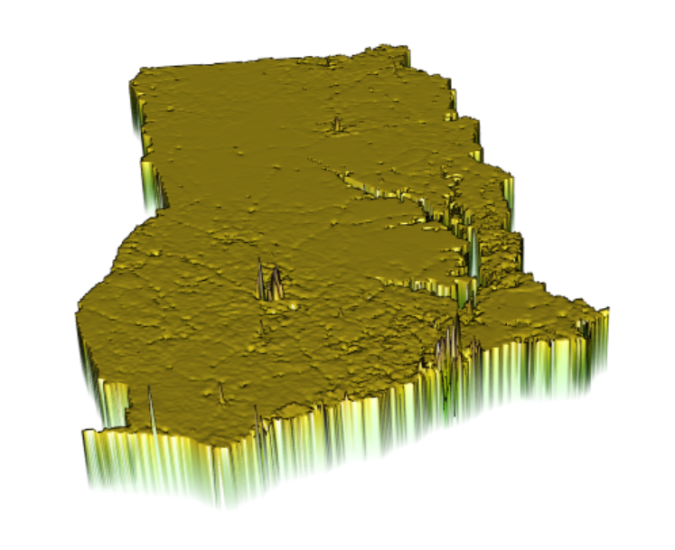
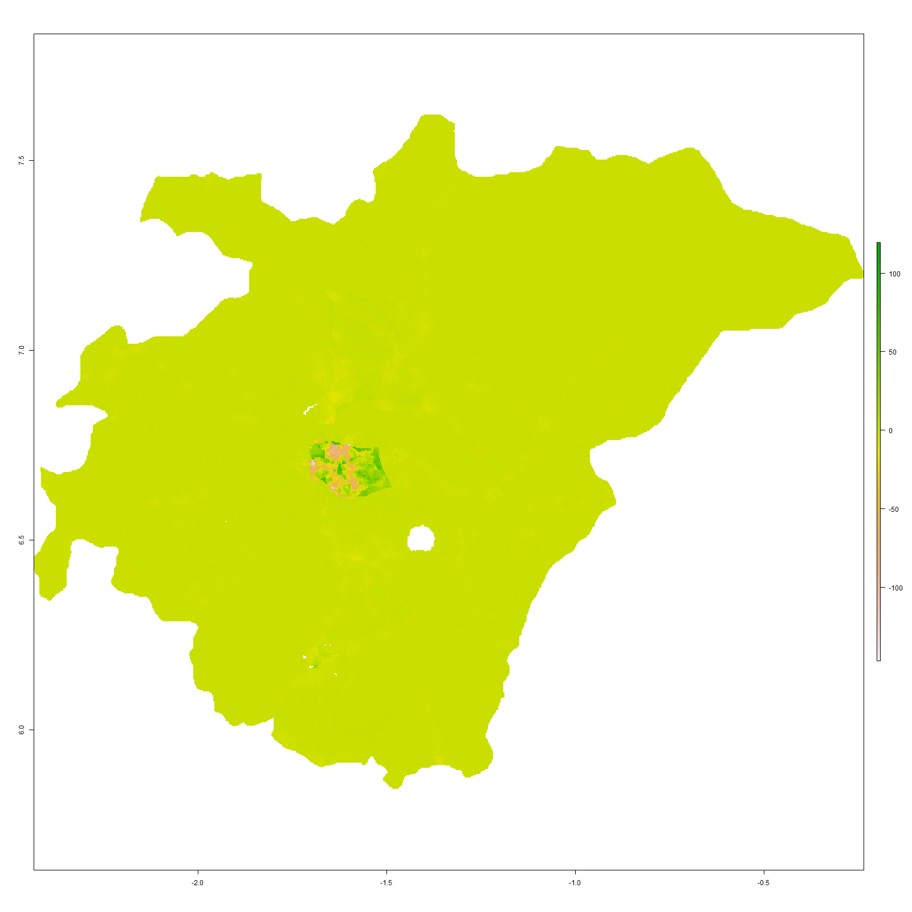

# Ghana

This is my final project on Ghana

## Administrative subdivision of Ghana

There are 10 political regions and 139 cities in Ghana. Across the national boundary, southern regions including Western, Central and Greater Accra Region connect to the north Atlantic Ocean. Its capital Accra city lies in the Greater Accra region, which is in the south_eastern part of Ghana. 

The two regions I selected are Ashanti region and Eastern. Ashanti, in the north-west direction of Greater Accra, is the most populated region in Ghana. Surrounded by other 4 regions, Ashanti is also center of southern Ghana. Among 21 subdivided cities in Ashanti, Kumasi
is both the economic and geographic center. Eastern region is between the Greater Accra Region and Ashanti region. It has 17 cities, including Kwahu West and Atiwa.

## Population of Ghana's regions

This is a bar plot of regional population. Ashanti and Accra is two main regions where 37% people of the whole nation live.

## Population of Ghana's districts

This is a picture indicating the log of population of Ghana's districts. Red parts indicate the most populated areas as described before, Kumasi and Accra city. Purple regions represent comparatively less populated areas, like Upper West Region and Northern Region. Overall, the southern parts of Ghana are more populated than northern parts of Ghana.

   
   
This is a 3 dimentional rotation gif of district population. The higher the 3D picture, the more people live in that area. It's comfirmed by 3D picture that population concentrates in southern regions.
   
## Histograms 

Two density histograms of ntl(night time lights) and log of population.
Two plots both indicate 1-2 regions have large population and they use more lights at night.

## Regression model of Ghana's population

I used the population of Ghana in 2015 and variable datasets like water, dst, topo, slope, and ntl(night time lights).
From the regression model there are 5-7 points that are far above or beneath the curve. As expected, these points are mostly in Greater Accra or Ashanti.
 
## Difference plot

 

## Predicted population plot of Ghana

The most accurate result is produced by using population as response variable and mean of covariates as predictors

## Predicted population of Ashanti

Also, use the same method to zoom in Ashanti region. The differences are mostly in Kumasi, the central city.

## Humansettlements, roads and health facilities

