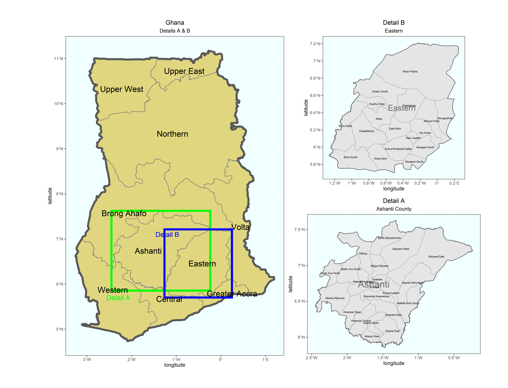
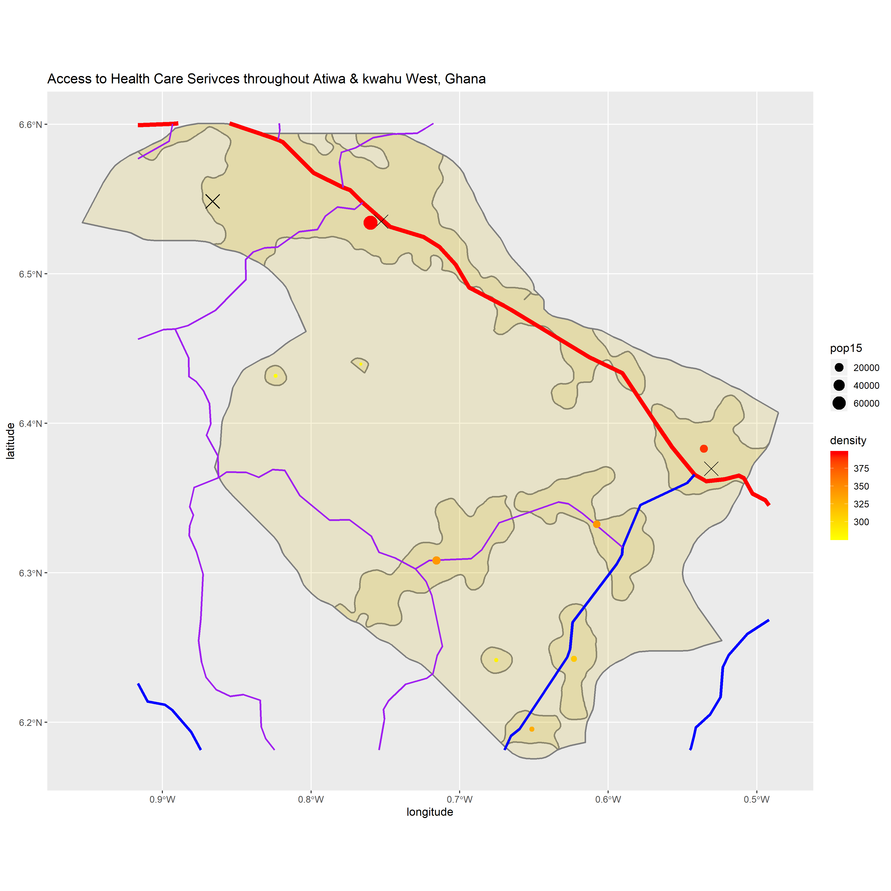
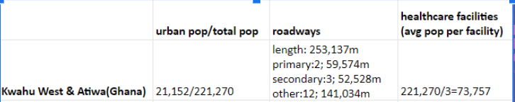

# Ghana

This is my final project on Ghana

## Administrative Subdivision of Ghana

There are 10 administrative regions and 139 cities in Ghana. Across the national boundary, southern regions including Western, Central and Greater Accra Region connect to the north Atlantic Ocean. Its capital Accra city lies in the Greater Accra region, which is located in the south_eastern part of Ghana.  

The two regions I selected are the Ashanti region and Eastern. Ashanti, in the north-west direction of Greater Accra, is the most populated region in Ghana. Surrounded by other 4 regions, Ashanti is also center of southern Ghana. Among 21 subdivided cities in Ashanti, Kumasi is both the economic and geographic center. The eastern region is between the Greater Accra Region and Ashanti region. It has 17 cities, including Kwahu West and Atiwa.

## Population of Ghana's Regions

This is a bar plot of the regional population. Ashanti and Accra are two main regions where 37% people of the whole nation live.

## Population of Ghana's Districts

This is a picture indicating the log of the population of Ghana's districts. Red parts indicate the most populated areas described before, Kumasi and Accra city. Purple regions represent comparatively less populated areas, like Upper West Region and Northern Region. Overall, the southern parts of Ghana are more populated than northern parts of Ghana.
   
   
   
This is a 3 dimensional rotation gif of the district population. The higher the 3D picture, the more people live in that area. It's confirmed by 3D picture that population concentrates in southern regions.

## Histograms 

Two density histograms of ntl(night time lights) and log of population.
Two plots both indicate 1-2 regions have a large population and they use more light at night.

## Regression Model of Ghana's Population

I used the population of Ghana in 2015 and variable datasets like water, dst, topo, slope, and ntl(night time lights).
From the regression model there are 5-7 points that are far above or beneath the curve. As expected, these points are mostly in Greater Accra or Ashanti.
 
## Difference Plot

 

This is the Difference plot of Kumasi, the center of the Ashanti Region. The result shows we overestimated the population in central parts and underestimated other areas.

## Predicted Population Plot of Ghana

The most accurate result is produced by using population as response variable and mean of covariates as predictors.

## Predicted Population of Ashanti

Also, use the same method to zoom in the Ashanti region. The differences tend to be in Kumasi, the central city.

## Humansettlements, Roads and Health Care Facilities

I choose the Atiwa and Kwahu West in the Eastern Region to study the human settlements, roads and their health care facilities.
The Eastern is right in the middle between Greater Accra and Ashanti. From the previous results, Eastern part is a fairly developed region. It's not as desolate as northern parts nor as it populated as Accra and Ashanti. To some extent, it represents such average level of Ghana.

Regional population is 221,270. There are 9 urban areas.

There is one national road in red line connecting from north-western part to the south-eastern part. This national road is also extending to Greater Accra and Ashanti. There are 5 regional roads in blue line and other roads in the purple line. These roads have many intersections in or near provincial centers like Nkawkaw. There are three hospitals in two principal urban areas. Thanks to road connection, hospitals are accessible. One issue is the health facility type is too limited as there is no clinic. For people in urban areas, it is extremely convenient if they need health care because hospitals are near regional centers. For people in rural areas, it's costly and time-consuming to get to hospitals.

Urban areas are on a flat plain although there are mountains around the region.
Almost all kinds of roads avoid mountainous areas where no one lives.

## Human development Assessment

The variety of roads and their intersections contributes to the convenience of traveling and access to hospitals, as well as the entire regional development. Within the region, people can easily travel to city centers and receive retreatments from hospitals there. However, there should be more improvements for people in rural area due to lack of clinics, which may lead to the risk of dying from emergencies. Overall, this region is a fairly developed place with adequate roadways for traveling and evenly distributed hospitals.

